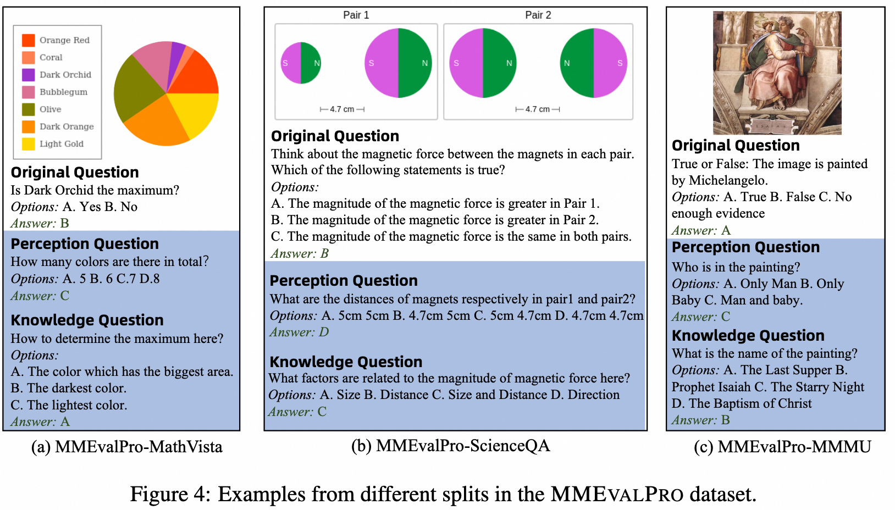
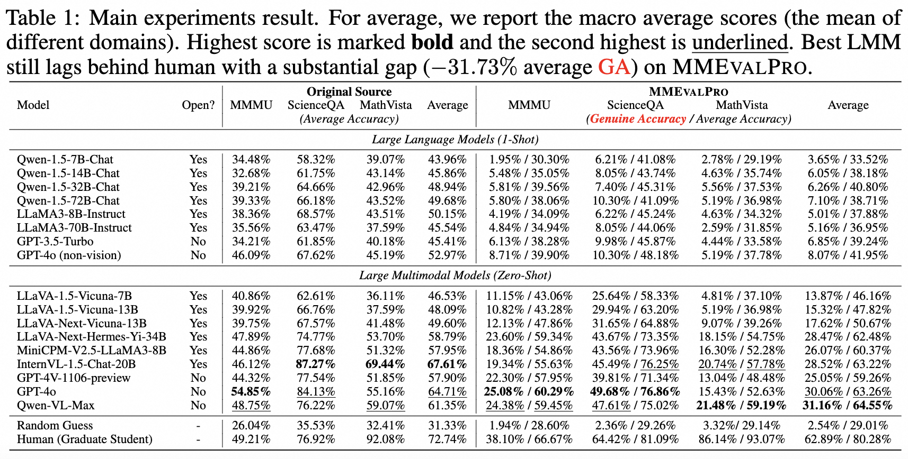

<h1 align="center">MMEvalPro</h1>

<p align="center">

<a href="https://docs.qq.com/sheet/DVUd4WUpGRHRqUnNV">

</a>

<a href="https://arxiv.org/abs/2402.15527">


<a href="https://huggingface.co/datasets/MM-Diagnose/MMEvalPro">

</a>

</p>


We create **MMEvalPro** for more accurate and efficent evaluation for Large Multimodal Models. It is designed to avoid Type-I errors through a **trilogy** evaluation pipeline and more rigorous metrics. For each original question from existing benchmarks, human annotators augment it by creating one **perception** question and one **knowledge** anchor question through a meticulous annotation process. It comprises **2,068** question triplets, totaling **6,204** distinct questions.

## Trilogy Evaluation

For each original question from ScienceQA, MathVista, or MMMU, MMEvalPro annotates an additional perception question and a knowledge question. Only if a multimodal model can simultaneously answer all three questions, we regard it demonstrates a true understanding of the problem rather than merely exploiting shortcuts. We introduce a new metric called **Genuine Accuracy** to evaluate the performance of models in MMEvalPro.

<div align=center>

Trilogy Evaluation Examples in MMEvalPro
</div>


## Automatic Evaluation

🔔 To automatically evaluate a model on the dataset and compute the genuine accuracy, average accuracy and different analysis metric, we provide an example code to compute the scores given model output and groundtruth labels.

The output for each instance should be saved in json file, in the format of
```json
[
    {
        "index": 1,
        "model_output": "A",
        "answer": "B",
        "triplet_id": 1,
        "eval_type": "Origin"
    },
    {
        "index": 2,
        "model_output": "A",
        "answer": "B",
        "triplet_id": 1,
        "eval_type": "Perception"
    },
    {
        "index": 3,
        "model_output": "A",
        "answer": "B",
        "triplet_id": 1,
        "eval_type": "Knowledge"
    }
]
```
The `index`,`answer`,`triplet_id`,`eval_type` should be indentical to the ones in the dataset.

Then you can run the `./auto_score.py` to get the scores.


```bash
python auto_score.py \ 
    --model_output  ./demo_output.json \  # model output file in json format
    --output_path  ./demo_score.json \  # path to save the result
```

## Leaderboard
<div align=center>

All LLMs perform poorly in the benchmark due to the rigorous metric. Best performing LMM (Qwen-VL-Max, GPT4-o) still lag behind human by 30% in average Genuine Accuracy of MMEvalPro. 
</div>


## Acknowledgements

We thank the creators of ScienceQA, MathVista and MMMU for providing the excellent evaluation resources!

## License

The new contributions to our dataset are distributed under the [CC BY-SA 4.0](https://creativecommons.org/licenses/by-sa/4.0/) license, including

The copyright of the images and the original questions belongs to the authors of MMMU, ScienceQA and MathVista

- **Purpose:** The dataset was primarily designed for use as a test set. 
- **Commercial Use:** The dataset can be used commercially as a test set, but using it as a training set is prohibited. By accessing or using this dataset, you acknowledge and agree to abide by these terms in conjunction with the [CC BY-SA 4.0](https://creativecommons.org/licenses/by-sa/4.0/) license.

## Citation

Coming Soon~
